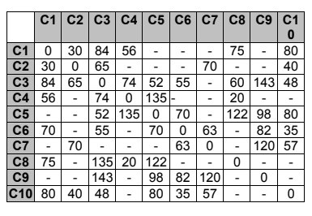

# O-problema-do-caixeiro-viajante
 
Um caixeiro viajante precisa visitar 10 cidades do interior de Pernambuco. Ele pede a um agente de busca que determine uma rota para sua visita tal que cada cidade só seja visitada uma única vez, e ele percorra o menor espaço possível (em Km). O agente de busca tem um mapa do estado, e portanto sabe as distâncias entre as cidades. Formule e implemente este problema em termos de estado inicial, estado final, operadores e função de avaliação para Busca por melhoras iterativas com Hill-Climbing.

O operador considerado para gerar os filhos do estado corrente é permutar as cidades da rota atual duas a duas, e verificar em seguida se o caminho está conectado (segundo a tabela abaixo, que representa o mapa da questão). A cidade inicial deve ser mantida, uma vez que o caixeiro mora lá ! A rota é fechada (ele volta à cidade de origem no final).

## A resolução e feita em 3 arquivos, o ***VC.c*** que responsável pela parte da resolução do problema, o ***Grafo.c*** que serve para criar No e Aresta(funções para gerenciamento um grafo), tambem contem o mapa em forma de grafo e o ***Lista.c*** que responsável por cria Lista(funções para gerenciamento uma Lista).

## O algoritmo busca resolver o problema dos problema do caixeiro viajante, por meio da implementação de *** Hill-Climbing ***.

### Onde o algoritmo escolhe uma solução qualquer, depois ele vai pega uma da posições e permutar 8 vezes, e verificar se existe solução e quanto e seu custo,depois ele selecionar a que tem menor custo é roda mais uma vezes para verificar se tem permutação com menor custo. Se não existir solução melhor, independendo de se e um minimo local ou um global ele considera aquela a melhor solução.

## No arquivo ***Out.txt*** podemos ver o alguns teste da resolução do problema.
